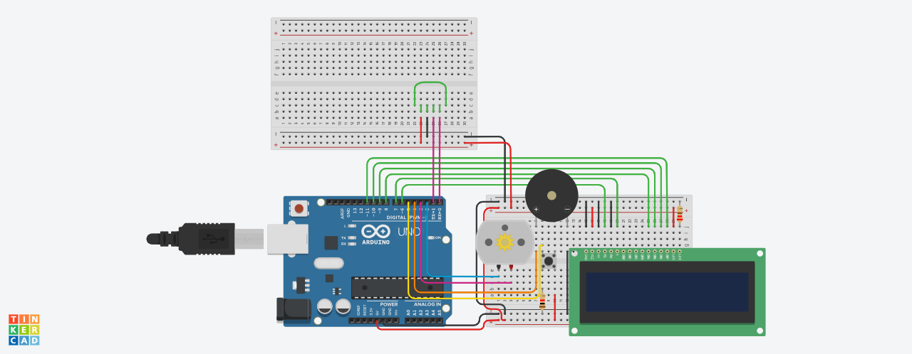

# microwave_simulation
Simulating the working of a microwave using Arduino

---
## Introduction
This project involves simulating the simple microwave operations, which include:
1. Power ON
2. Power OFF
3. Set timer
4. Run timer - cook the food
5. Display timer on screen (LCD)
6. Alerts - error messages, timer completer (via a tone)

Additionally, the system designed includes a *Bluetooth* module, which allows it to be connected  
directly to a wireless device to send commands remotely, meaning that its operations can be controlled  
at a distance, without interacting directly with the system user interface.

---

### Tinkercad Circuit
